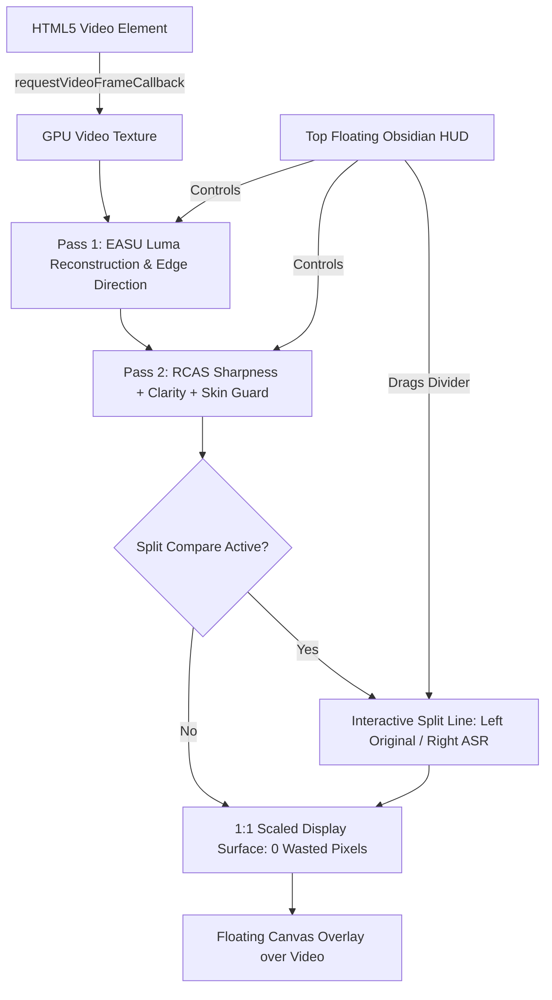

# Implementation Plan: Crush ASR Clarity Engine (Native Video Super Resolution & Top HUD)

## Goal Description
Implement a next-generation GPU-accelerated video super-resolution, enhancement, and control system in Crush Sovereign Browser. The system ports KIRA's battle-tested **Atomic Super Resolution (ASR)** 2-pass spatial upscaler (EASU + RCAS with theoretical clamping, clarity boost, and skin preservation) into a high-performance WebGL2 shader pipeline. It replaces Firefox's clunky right-edge Picture-in-Picture button with a sleek, floating Opera-style top-center HUD featuring:
1. **Native Picture-in-Picture** button (triggering native `requestPictureInPicture()`).
2. **ASR Clarity / Super Resolution** toggle pill with live status and popout calibration drawer (Sharpness, Clarity, Skin Guard, Debanding).
3. **Interactive Split-Screen Before/After Compare Slider** with draggable dividing line.
4. **Physical Display Pixel Detection** (scaling to 1440p/4K native display raster with 0 wasted pixels).

---

## User Review Required

> [!IMPORTANT]
> **Branding & Trademark Compliance (Rule 27 & 28)**:
> We will extract the mechanics of Opera's floating video controls and before/after comparison slider, but we will not copy Opera's trademarked name "Lucid Mode" or Opera's branding. The feature will be branded natively as **Crush ASR Clarity Engine** (or **Atomic Clarity**).

> [!TIP]
> **Performance Architecture**:
> Rendering runs directly on your GPU through WebGL2 with Direct3D 11/12 ANGLE backend using `HTMLVideoElement.requestVideoFrameCallback()`. When ASR is inactive, the WebGL overlay sleeps at 0% GPU/CPU overhead.

---

## Technical Architecture & Mathematical Foundation (from KIRA)



### 1. Two-Pass EASU -> RCAS Shader Pipeline
Ported directly from KIRA's `color_convert.hlsl` and `compositor_asr.rs`:
- **Pass 1: Edge-Adaptive Spatial Upscaling (EASU)**:
  - 12-tap cross pattern (`sB, sC, sE, sF, sG, sH, sI, sJ, sK, sL, sN, sO`).
  - Anisotropic edge detection across 4 neighborhoods:
    `AccumulateEdge(dir, len, w0, sB, sE, sF, sG, sJ)`
  - Lanczos-2 approximation weighting:
    `w = (wB * wB * (25.0 / 16.0) - (25.0 / 16.0 - 1.0)) * (wA * wA)`
  - Anti-ringing clamp with edge-adaptive headroom (0.22 - 0.35) using 4-tap and 12-tap min/max bounds:
    `outY = clamp(reconstructedY, max(min4 - headroom * (max4 - min4), min12), min(max4 + headroom * (max4 - min4), max12))`
  - 9-tap Mean Absolute Deviation (MAD) linear chaos calculation.

- **Pass 2: Robust Contrast-Adaptive Sharpening (RCAS)**:
  - 4-tap hard cross (`b, d, f, h`) blended with 4-tap soft cross (`nw, ne, sw, se`).
  - Noise floor attenuation: `smoothstep(0.008, 0.024, contrast)` suppresses video compression grain and sensor noise.
  - Edge guard: `1.0 - smoothstep(0.55, 0.90, contrast)` prevents ringing artifacts on sharp high-contrast text or edges.
  - Luma depth guard: `smoothstep(0.01, 0.04, e) * (1.0 - smoothstep(0.96, 0.995, e))` preserves deep blacks and specular highlights.
  - **Theoretical Max Clamping (KIRA Invariant)**:
    ```glsl
    float max_darken = e - 0.065;
    float max_brighten = e + 0.135;
    y_raw = clamp(y_raw, max_darken, max_brighten);
    ```
    *Guarantees that even at 100% maximum sharpness setting, the output can NEVER cross theoretical limits or break the image.*

- **Pass 3: Skin Tone Preservation & Detail Enhancement**:
  - Human skin tone detection in YCoCg space (`Co` positive orange axis, `Cg` subtle green/magenta axis).
  - Skin mask attenuates harsh high-frequency sharpening on faces by 65%, keeping skin smooth and natural, while eyes, hair, teeth, clothing, and background details receive 100% acuity reconstruction.

- **Pass 4: High-Acuity Debanding**:
  - Detects low-variance step gradients in 8-bit encoded video.
  - Applies a high-frequency triangular dither to smooth out color banding in skies and shadows.

- **Pass 5: Display Pixel Detection (0 Wasted Pixels)**:
  - Samples `window.devicePixelRatio` and canvas client dimensions (`getBoundingClientRect()`).
  - Sets the canvas backing store resolution to `Math.round(rect.width * devicePixelRatio) x Math.round(rect.height * devicePixelRatio)`.
  - Maps low-resolution 720p/1080p video directly to native 1440p/4K display pixels with zero bilinear blur.

---

## UI/UX: Floating Top HUD & Split-Screen Compare

### 1. In-Player Top Floating HUD
- Located at top-center of the video viewport (`top: 16px; left: 50%; transform: translateX(-50%)`).
- Auto-hides when mouse is idle (2.5s timeout); smoothly fades in upon mouse movement over the video.
- Obsidian dark glassmorphism styling (`background: rgba(7, 8, 12, 0.85); backdrop-filter: blur(16px); border: 1px solid rgba(0, 210, 255, 0.25)`).
- Contains 3 dedicated controls:
  1. **Picture-in-Picture Button**: Clean icon that triggers native `video.requestPictureInPicture()`.
  2. **ASR Clarity Pill**: Displays `✦ ASR OFF` (subtle gray) or `✦ ASR ON` (glowing cyan). Clicking toggles ASR. Hovering or clicking the chevron opens the **ASR Tuning Drawer**:
     - *Sharpness Slider* (0% - 100%, default 65%)
     - *Clarity Boost Slider* (0% - 100%, default 50%)
     - *Skin Preservation Toggle* (Default ON)
     - *Debanding Filter Toggle* (Default ON)
  3. **Split Compare Button**: `◧ Compare` toggle button.

### 2. Interactive Split-Screen Before/After Divider
- When Compare Mode is enabled, the shader renders original video on the left side of the split line and ASR enhanced video on the right.
- A 2px glowing cyan line with a central draggable circular handle splits the video.
- Hovering/dragging the divider scrubs the comparison boundary horizontally across the video from 0% to 100%.
- Subtle labels "ORIGINAL" (left) and "ASR ENHANCED" (right) float near the divider line.

### 3. Exterminate Firefox Popout Logo
- Set `media.videocontrols.picture-in-picture.video-toggle.enabled: false` in `crush.js` and `user.js`.
- The awkward gray popout square on the right edge is permanently extinguished.

---

## Proposed Changes

### Configuration & Preferences
#### [MODIFY] [crush.js](file:///c:/Users/aryan/Desktop/crush/engine/objdir-crush/dist/bin/browser/defaults/preferences/crush.js)
- Disable Firefox's right-edge PIP video toggle:
  `pref("media.videocontrols.picture-in-picture.video-toggle.enabled", false);`
- Enable WebGL2 compute & floating-point texture support:
  `pref("webgl.enable-webgl2", true);`

#### [MODIFY] [sync-extensions.ps1](file:///c:/Users/aryan/Desktop/crush/scripts/sync-extensions.ps1)
- Add `pref("media.videocontrols.picture-in-picture.video-toggle.enabled", false);` to template preferences.
- Register `crush-clarity@crush.browser` in `policies.json` ExtensionSettings.

#### [MODIFY] [user.js](file:///c:/Users/aryan/Desktop/crush/sandbox/s3_google_signin_drm/profile/user.js)
- Add `user_pref("media.videocontrols.picture-in-picture.video-toggle.enabled", false);`.

---

### Core Extension: `extensions/crush-clarity`
#### [NEW] [manifest.json](file:///c:/Users/aryan/Desktop/crush/extensions/crush-clarity/manifest.json)
- Manifest V2 extension:
  - Permissions: `<all_urls>`, `storage`.
  - Content scripts: `clarity_hud.css`, `asr_pipeline.js`, `clarity_overlay.js` running at `document_idle`.

#### [NEW] [asr_shaders.js](file:///c:/Users/aryan/Desktop/crush/extensions/crush-clarity/asr_shaders.js)
- Contains GLSL shader sources:
  1. Vertex Shader (Full-screen quad pass).
  2. EASU Luma & Direction Pass fragment shader.
  3. RCAS Sharpening + Clarity + Skin Guard + Clamping + Split Compare fragment shader.

#### [NEW] [asr_pipeline.js](file:///c:/Users/aryan/Desktop/crush/extensions/crush-clarity/asr_pipeline.js)
- WebGL2 Context Manager:
  - FBO intermediate textures (EASU render target, output backbuffer).
  - Uniform management: `u_dims`, `u_sharpness`, `u_clarity`, `u_skin_guard`, `u_split_x`, `u_split_enabled`.
  - Frame loop driven by `video.requestVideoFrameCallback()`.
  - Dynamic resolution tracking matching `window.devicePixelRatio`.

#### [NEW] [clarity_overlay.js](file:///c:/Users/aryan/Desktop/crush/extensions/crush-clarity/clarity_overlay.js)
- Video observer and DOM controller:
  - Detects all `<video>` elements (handles dynamic SPA navigation on YouTube/Twitch).
  - Mounts canvas overlay and floating obsidian HUD.
  - Handles mouse hover timer (fades HUD in/out).
  - Handles split-screen drag events and slider settings persistence via `browser.storage.local`.

#### [NEW] [clarity_hud.css](file:///c:/Users/aryan/Desktop/crush/extensions/crush-clarity/clarity_hud.css)
- Obsidian dark glassmorphism styling for floating HUD, toggle pills, slider drawer, and draggable split line.

---

## Verification Plan

### Automated Tests
1. Verify syntax and compilation of GLSL fragment shaders in headless WebGL2 test.
2. Verify extension packaging: build `crush-clarity@crush.browser.xpi` into `distribution/extensions/`.
3. Verify `policies.json` and `crush.js` syntax via `sync-extensions.ps1`.

### Manual Verification
1. Launch Crush via `scripts/launch-test-profile.ps1 -KillStale -Url "https://www.youtube.com"`.
2. Verify Firefox's right-edge gray PIP button is completely gone.
3. Hover over YouTube video: verify sleek top-center floating HUD appears with 3 icons (`PIP`, `✦ ASR`, `◧ Compare`).
4. Toggle `✦ ASR ON`: verify instant video upscaling and acuity enhancement.
5. Click `◧ Compare`: verify vertical split line appears with original video on left and ASR on right; drag divider to compare before/after in real-time.
6. Push Sharpness to 100%: verify theoretical clamp prevents ringing or image destruction.
